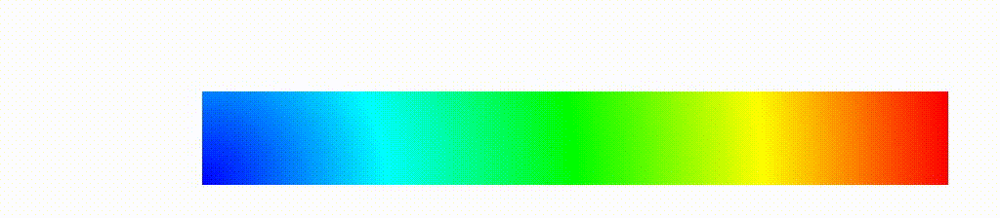
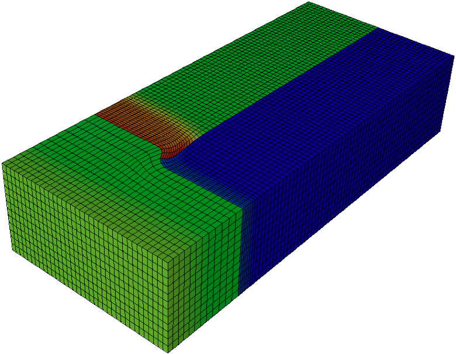

# Example Applications

This page provides a list of libROM example applications.  For detailed
documentation of the libROM sources, including the examples, see the [online
Doxygen documentation](http://software.llnl.gov/libROM/html/index.html) or the `doc` directory in the distribution.  The goal of the example
codes is to provide a step-by-step introduction to libROM in simple model
settings.

Select from the categories below to display examples and miniapps that contain
the respective feature. _All examples support (arbitrarily) high-order meshes
and finite element spaces_.  The numerical results from the example codes can
be visualized using the GLVis or VisIt visualization tools. See the [GLVis
](http://glvis.org) and [VisIt](https://visit-dav.github.io/visit-website/)
websites for more details.

Users are encouraged to submit any example codes and miniapps that they have
created and would like to share.  
_Contact a member of the libROM team to report
[bugs](https://github.com/LLNL/libROM/labels/bug)
or post [questions](https://github.com/LLNL/libROM/labels/question)
or [comments](https://github.com/LLNL/libROM/labels/comments)_.

   <h5>**Application (PDE)**</h5>
   <select id="group1" onchange="update()">
      <option id="all1">All</option>
      <option id="diffusion">Diffusion</option>
      <option id="elasticity">Elasticity</option>
      <option id="euler">Euler</option>
      <option id="navierstokes">Navier-Stokes</option>
      <option id="advection">Advection</option>
      <option id="hydro">Hydro-dynamics</option>
      <option id="vlasov">Vlasov</option>
   </select>

   <h5>**Reduced order models type**</h5>
   <select id="group2" onchange="update()">
      <option id="all2">All</option>
      <option id="prom">pROM</option>
      <option id="dmd">DMD</option>
   </select>

   <h5>**Parameterization type**</h5>
   <select id="group3" onchange="update()">
      <option id="all3">All</option>
      <option id="tr">Trust region</option>
      <option id="interpolation">Interpolation</option>
      <option id="global">Global</option>
      <option id="reproductive">Reproductive</option>
   </select>

   <h5>**hyper-reduction**</h5>
   <select id="group4" onchange="update()">
      <option id="all4">All</option>
      <option id="hr">Hyper-reduction</option>
      <option id="no_hr">No hyper-reduction</option>
   </select>

   <h5>**Physics code**</h5>
   <select id="group5" onchange="update()">
      <option id="all1">All</option>
      <option id="mfem">MFEM</option>
      <option id="laghos">Laghos</option>
      <option id="hypar">HyPar</option>
   </select>

 

<!-- ------------------------------------------------------------------------- -->

## Poisson Problem

This example code demonstrates the use of libROM and MFEM to define a reduced
order model for a simple isoparametric finite element discretization of the
Poisson problem $$-\Delta u = f$$ with homogeneous Dirichlet boundary
conditions. The example parameterizes the righthand side with frequency
variable, $\kappa$:

$$f =  
  \cases{
  \displaystyle \sin(\kappa (x_0+x_1+x_2)) & for 3D  \cr
  \displaystyle \sin(\kappa (x_0+x_1))     & for 2D  
  }$$

The 2D solution contour plot for $\kappa=1$ is shown in the figure
on the right to show the effect of $\kappa$. For demonstration, we sample
solutions at $\kappa=1$, $1.1$, and $1.2$. Then a ROM is build with basis size
of 3, which is used to predict the solution for $\kappa = 1.15$.  The ROM is
able to achieve a speedup of $7.5$ with a relative error of $6.4\times10^{-4}$.
One can follow the command line options below to reproduce the numerical results
summarized in the table below:

* **offline1**: poisson_global_rom -offline -f 1.0 -id 0
* **offline2**: poisson_global_rom -offline -f 1.1 -id 1
* **offline3**: poisson_global_rom -offline -f 1.2 -id 2
* **merge**: poisson_global_rom -merge -ns 3
* **online**: poisson_global_rom -online -f 1.15

   | FOM solution time | ROM solution time | Speed-up | Solution relative error |
   | ----------------- | ----------------- | -------- | ----------------------- |
   |  0.22 sec         |  0.029 sec        |   7.5    |           6.4e-4        |

_The code that generates the numerical results above can be found in
([poisson_global_rom.cpp](https://github.com/LLNL/libROM/blob/master/examples/prom/poisson_global_rom.cpp))
and the explanation of codes is provided in
[here](poisson.md#poisson-equation). 
The
[poisson_global_rom.cpp](https://github.com/LLNL/libROM/blob/master/examples/prom/poisson_global_rom.cpp)
is based on
[ex1p.cpp](https://github.com/mfem/mfem/blob/master/examples/ex1p.cpp) from
MFEM with a modification on the right hand side function._ 

 

## Heat conduction problem

For a given initial condition, i.e., $u_0(x) = u(0,x)$,
**heat conduction** solves a simple 2D/3D time dependent nonlinear heat conduction problem

$$\frac{\partial u}{\partial t} = \nabla\cdot (\kappa + \alpha u)\nabla u,$$

with a natural insulating boundary condition $\frac{du}{dn}=0$. We linearize
the problem by using the temperature field $u$ from the previous time step to
compute the conductivity coefficient.

One can run the following command line options to reproduce the DMD results
summarized in the table below:

* mpirun -np 8 ./heat_conduction -s 3 -a 0.5 -k 0.5 -o 4 -tf 0.7 -vs 1 -visit

   | FOM solution time | DMD setup  time | DMD query time | DMD relative error |
   | ----------------- | --------------- | -------------- | ------------------ |
   |  4.8 sec          |  0.34 sec       |   1.4e-3 sec   |      8.2e-4        |

_The code that generates the numerical results above can be found in
([heat_conduction.cpp](https://github.com/LLNL/libROM/blob/master/examples/dmd/heat_conduction.cpp)).
The
[heat_conduction.cpp](https://github.com/LLNL/libROM/blob/master/examples/dmd/heat_conduction.cpp)
is based on
[ex16p.cpp](https://github.com/mfem/mfem/blob/master/examples/ex16p.cpp) from MFEM._

 

## Parametric DMD heat conduction problem

This example demonstrates the **parametric DMD** on the [heat conduction
problem](examples.md#heat_conduction). The initial condition, $u_0(x)$, is
parameterized by the center of circle and the radius, i.e., 

$$u_0(x) =  
  \cases{
  \displaystyle 2 & for \|x-c\| < r  \cr
  \displaystyle 1 & for \|x-c\| $\ge$ r 
  }$$

One can run the following command line options to reproduce the parametric DMD results
summarized in the table below:

* rm -rf parameters.txt
* mpirun -np 8 parametric_heat_conduction -r 0.1 -cx 0.1 -cy 0.1 -o 4 -visit -offline -rdim 16
* mpirun -np 8 parametric_heat_conduction -r 0.1 -cx 0.1 -cy 0.5 -o 4 -visit -offline -rdim 16
* mpirun -np 8 parametric_heat_conduction -r 0.1 -cx 0.5 -cy 0.1 -o 4 -visit -offline -rdim 16
* mpirun -np 8 parametric_heat_conduction -r 0.1 -cx 0.5 -cy 0.5 -o 4 -visit -offline -rdim 16
* mpirun -np 8 parametric_heat_conduction -r 0.5 -cx 0.1 -cy 0.1 -o 4 -visit -offline -rdim 16
* mpirun -np 8 parametric_heat_conduction -r 0.25 -cx 0.2 -cy 0.4 -o 4 -visit -online -predict 
* mpirun -np 8 parametric_heat_conduction -r 0.4 -cx 0.2 -cy 0.3 -o 4 -visit -online -predict 

where r, cx, and cy specify the radius, the x and y coordinates of circular initial conditions. 

   | r | cx | cy | FOM solution time | DMD setup  time | DMD query time | DMD relative error |
   | - | -- | -- | ----------------- | --------------- | -------------- | ------------------ |
   | 0.25 | 0.2 | 0.4 | 13.3 sec     |  0.34 sec       |   1.2 sec     |      7.0e-3        |
   | 0.2  | 0.4 | 0.2 | 13.8 sec     |  0.32 sec       |   1.2 sec     |      3.9e-3        |
   | 0.3  | 0.3 | 0.3 | 13.6 sec     |  0.33 sec       |   1.1 sec     |      1.3e-2        |
   | 0.3  | 0.4 | 0.2 | 14.1 sec     |  0.34 sec       |   1.3 sec     |      8.4e-3        |
   | 0.2  | 0.3 | 0.4 | 14.2 sec     |  0.34 sec       |   1.3 sec     |      7.9e-3        |
   | 0.4  | 0.2 | 0.3 | 13.9 sec     |  0.36 sec       |   1.5 sec     |      9.0e-3        |

_The code that generates the numerical results above can be found in
([parametric_heat_conduction.cpp](https://github.com/LLNL/libROM/blob/master/examples/dmd/parametric_heat_conduction.cpp)).
The
[parametric_heat_conduction.cpp](https://github.com/LLNL/libROM/blob/master/examples/dmd/parametric_heat_conduction.cpp)
is based on
[ex16p.cpp](https://github.com/mfem/mfem/blob/master/examples/ex16p.cpp) from MFEM._

 

## Mixed nonlinear diffusion

For a given initial condition, i.e., $p_0(x) = p(0,x)$,
**mixed nonlinear diffusion problem** solves a simple 2D/3D time dependent nonlinear problem:

$$\frac{\partial p}{\partial t} + \nabla\cdot \boldsymbol{v} = f\,, \qquad \nabla p = -a(p)\boldsymbol{v},$$

with a natural insulating boundary condition $\frac{\partial v}{\partial n}=0$. The
$H(div)$-conforming Raviart-Thomas finite element space is used for the velocity function $\boldsymbol{v}$,
and the $L^2$ finite element space is used for pressure function, $p$.
This example introduces how the hyper-reduction is implemented and how the
reduced bases for two field varibles, $p$ and $\boldsymbol{v}$.

One can run the following command line options to reproduce the DMD results
summarized in the table below:

* **offline1**: ./mixed_nonlinear_diffusion -m ../dependencies/mfem/data/inline-quad.mesh -p 1 -offline -id 0 -sh 0.25
* **offline2**: ./mixed_nonlinear_diffusion -m ../dependencies/mfem/data/inline-quad.mesh -p 1 -offline -id 1 -sh 0.15
* **merge**: ./mixed_nonlinear_diffusion -m ../dependencies/mfem/data/inline-quad.mesh -p 1 -merge -ns 2
* **offline3**: ./mixed_nonlinear_diffusion -m ../dependencies/mfem/data/inline-quad.mesh -p 1 -offline -id 2 -sh 0.2
* **online**: ./mixed_nonlinear_diffusion -m ../dependencies/mfem/data/inline-quad.mesh -p 1 -online -rrdim 8 -rwdim 8 -sh 0.2 -id 2

   | FOM solution time | ROM solution time | Speed-up       | Solution relative error |
   | ----------------- | ----------------- | -------------- | ----------------------- |
   |  41.68 sec        |  1.7 sec          |   24.5         |      1.6e-3             |

_The code that generates the numerical results above can be found in
([mixed_nonlinear_diffusion.cpp](https://github.com/LLNL/libROM/blob/master/examples/prom/mixed_nonlinear_diffusion.cpp)).
The
[mixed_nonlinear_diffusion.cpp](https://github.com/LLNL/libROM/blob/master/examples/prom/mixed_nonlinear_diffusion.cpp)
is based on
[ex16p.cpp](https://github.com/mfem/mfem/blob/master/examples/ex16p.cpp) from MFEM and modified to support mixed finite element approach._

 

## 1D linear advection - Discontinuous pulses

For a given initial condition, i.e., $u_0(x) = u(0,x)$, **1D lienar advection**
of the form

$$\frac{\partial u}{\partial t} + c\frac{\partial x}{\partial t} = 0,$$

where $c$ is advection velocity. 
The initial condition, $u_0(x)$, is given by 

$$u_0(x) =  
  \cases{
  \displaystyle exp\left (-log(2)\frac{(x+7)^2}{0.0009}\right ) & for -0.8 $\le$ x $\le$ -0.6 \cr
  \displaystyle 1 & for -0.4 $\le$ x $\le$ -0.2 \cr
  \displaystyle 1-|10(x-0.1)| & for 0 $\le$ x $\le$ 0.2 \cr
  \displaystyle \sqrt{1-100(x-0.5)^2} & for 0.4 $\le$ x $\le$ 0.6 \cr
  \displaystyle 0 & \text{otherwise}
  }$$

The DMD is applied to accelerate the advection simulation:

   | FOM solution time | DMD setup time  | DMD query time | 
   | ----------------- | --------------- | -------------- |
   |  3.85 sec         |  0.18 sec       |  0.027 sec     |

The instruction of running this simulation can be found at 
the [HyPar](http://hypar.github.io/a00130.html) page.

 

## Advection

For a given initial condition, i.e., $u_0(x) = u(0,x)$,
**DG advection** solves the time-dependent advection problem:

$$\frac{\partial u}{\partial t} + v\cdot\nabla u = 0,$$

where $v$ is a given advection velocity.

One can run the following command line options to reproduce the DMD results
summarized in the table below:

* dg_advection -p 3 -rp 1 -dt 0.005 -tf 4 -visit

   | FOM solution time | DMD setup  time | DMD query time | DMD relative error |
   | ----------------- | --------------- | -------------- | ------------------ |
   |  5.2 sec          |  30.6 sec       |   1.9e-2 sec   |      1.9e-4        |

_The code that generates the numerical results above can be found in
([dg_advection.cpp](https://github.com/LLNL/libROM/blob/master/examples/dmd/dg_advection.cpp)).
The
[dg_advection.cpp](https://github.com/LLNL/libROM/blob/master/examples/dmd/dg_advection.cpp)
is based on
[ex9p.cpp](https://github.com/mfem/mfem/blob/master/examples/ex9p.cpp) from MFEM._

 

## 1D Euler Equation, Sod Shock Tube 

**1D Euler equations** of the form

$$ \frac{\partial \rho}{\partial t} + \frac{\partial \rho u}{\partial x} = 0$$
$$ \frac{\partial \rho u}{\partial t} + \frac{\partial \rho u^2 + p}{\partial x} = -\rho g$$
$$ \frac{\partial e}{\partial t} + \frac{\partial (e+p)u}{\partial x} = -\rho u g$$

is solved with the initial condition given by

$$ \rho = 1, u = 0, p = 1 \text{ for } 0 \le x < 0.5$$
$$ \rho = 0.125, u = 0, p = 0.1 \text{ for } 0.5 \le x \le 1$$.

The DMD is applied to accelerate the 1D Sod shock tube simulation:

   | FOM solution time | DMD setup time  | DMD query time | 
   | ----------------- | --------------- | -------------- |
   |  0.86 sec         |  0.13 sec       |  0.0027 sec    |

The instruction of running this simulation can be found at 
the [HyPar](http://hypar.github.io/a00132.html) page.

 

## 2D Euler Equation, Isentropic Vortex Convection

**2D Compressible Euler equations** of the form

$$ \frac{\partial \rho}{\partial t} + \frac{\partial \rho u}{\partial x} + \frac{\partial \rho v}{\partial y}= 0$$
$$ \frac{\partial \rho u}{\partial t} + \frac{\partial \rho u^2 + p}{\partial x} + \frac{\partial \rho uv}{\partial y} = -\rho g_x$$
$$ \frac{\partial \rho v}{\partial t} + \frac{\partial \rho uv}{\partial x} + \frac{\partial \rho v^2 + p}{\partial y} = -\rho g_y$$
$$ \frac{\partial e}{\partial t} + \frac{\partial (e+p)u}{\partial x} + \frac{\partial (e+v)p}{\partial y} = -\rho u g_x - \rho v g_y$$

is solved with the free-stream condition given by

$$ \rho_\infty = 1, u_\infty = 0.1, v_\infty = 0, p_\infty = 1 $$

and a vortex is introduced by

$$ \rho = \left ( 1-\frac{(\gamma-1)b^2}{8\gamma \pi^2} e^{1-r^2} \right )^{\frac{1}{r-1}}, p = \rho^\gamma$$
$$ u = u_\infty - \frac{b}{2\pi} e^{\frac{1}{2}(1-r^2)}(y-y_c)$$
$$ v = v_\infty + \frac{b}{2\pi} e^{\frac{1}{2}(1-r^2)}(x-x_c),$$

where $b=0.5$ is the vortex strength and $r = \left ( (x-x_c)^2 + (y-y_c)^2 \right )^{\frac{1}{2}}$ is the distance from the vortex center $(x_c,y_c) = (5,5)$.

The DMD is applied to accelerate the vortex convection simulation:

   | FOM solution time | DMD setup time  | DMD query time | 
   | ----------------- | --------------- | -------------- |
   |  5.85 sec         |  5.25 sec       |  0.28 sec      |

The instruction of running this simulation can be found at 
the [HyPar](http://hypar.github.io/a00134.html) page.

 

## 2D Euler Equation, Riemann Problem 

**2D Compressible Euler equations** of the form

$$ \frac{\partial \rho}{\partial t} + \frac{\partial \rho u}{\partial x} + \frac{\partial \rho v}{\partial y}= 0$$
$$ \frac{\partial \rho u}{\partial t} + \frac{\partial \rho u^2 + p}{\partial x} + \frac{\partial \rho uv}{\partial y} = -\rho g_x$$
$$ \frac{\partial \rho v}{\partial t} + \frac{\partial \rho uv}{\partial x} + \frac{\partial \rho v^2 + p}{\partial y} = -\rho g_y$$
$$ \frac{\partial e}{\partial t} + \frac{\partial (e+p)u}{\partial x} + \frac{\partial (e+v)p}{\partial y} = -\rho u g_x - \rho v g_y$$

is solved. The DMD is applied to accelerate the Riemann problem:

   | FOM solution time | DMD setup time  | DMD query time | 
   | ----------------- | --------------- | -------------- |
   |  111.1 sec        |  17.6 sec       |  1.4 sec       |

The instruction of running this simulation can be found at 
the [HyPar](http://hypar.github.io/a00136.html) page.

 

## Euler equation

For a given initial condition, i.e., $u_0(x) = u(0,x)$,
**DG Euler** solves the compressible Euler system of equation, i.e., a model
nonlinear hyperbolic PDE:

$$\frac{\partial u}{\partial t} + \nabla\cdot \boldsymbol{F}(u) = 0,$$

with a state vector $\boldsymbol{u} = [\rho,\rho v_0, \rho v_1, \rho E]$, where
$\rho$ is the density, $v_i$ is the velocity in the $i$th direction, $E$ is the
total specific energy, and $H = E + p/\rho$ is the total specific enthalpy. The
pressure, $p$ is computed through a simple equation of state (EOS) call. The
conservative hydrodynamic flux $\boldsymbol{F}$ in each direction $i$ is

  $$\boldsymbol{F}_i = [\rho v_i, \rho v_0 v_i + p \delta\_{i,0}, \rho v_1 v\_{i,1} +
p\delta\_{i,1}, \rho v_i H]$$

One can run the following command line options to reproduce the DMD results
summarized in the table below:

* mpirun -n 8 ./dg_euler -p 2 -rs 2 -rp 1 -o 1 -s 3 -visit

   |                   |                |                |                |  DMD rel.error |         |        |
   | ----------------- | -------------- | -------------- | -------------- | ----------- | ---------- | ------ |
   | FOM solution time | DMD setup time | DMD query time |    $\rho$      |  $\rho v_0$ | $\rho v_1$ | $E$    |
   |  5.65 sec         |  38.9 sec      |   1.4e-3 sec   |      8.0e-7    |    1.2e-4   | 1.6e-3     | 2.6e-6 |

_The code that generates the numerical results above can be found in
([dg_euler.cpp](https://github.com/LLNL/libROM/blob/master/examples/dmd/dg_euler.cpp)).
The
[dg_euler.cpp](https://github.com/LLNL/libROM/blob/master/examples/dmd/dg_euler.cpp)
is based on
[ex18p.cpp](https://github.com/mfem/mfem/blob/master/examples/ex18p.cpp) from
MFEM._

 

## 2D Navier–Stokes Equations, Lid-driven square cavity problem 

A lid-driven square cavity problem is solved. The two references for this problem are

- Erturk, E., Corke, T.C., and Gokcol, C., ``[Numerical Solutions of 2-D Steady Incompressible Driven Cavity Flow at High Reynolds Numbers](https://onlinelibrary.wiley.com/doi/10.1002/fld.953)", International Journal for Numerical Methods in Fluids, 48, 2005
- Ghia, U., Ghia, K.N., Shin, C.T., ``[High-Re Solutions for Incompressible Flow using the Navier-Stokes Equations and a Multigrid Method](https://www.sciencedirect.com/science/article/pii/0021999182900584?via%3Dihub)", Journal of Computational Physics, 48, 1982

The DMD is applied to accelerate the cavity flow simulation:

   | FOM solution time | DMD setup time  | DMD query time | 
   | ----------------- | --------------- | -------------- |
   |  554.6 sec        |  58.6 sec       |  0.3 sec       |

The instruction of running this simulation can be found at 
the [HyPar](http://hypar.github.io/a00140.html) page.

 

## 1D-1V Vlasov Equation, Self-consistent E-field 

The 1D-1V Vlasov equatoin is solved with the initial condition given by

$$ f(x,v) = \frac{4}{\pi T} \left ( 1+\frac{1}{10} cos(sk\pi\frac{x}{L}) \right ) \left ( \exp\left( -\frac{(v-2)^2}{2T} \right) + \exp\left( -\frac{(v+2)^2}{2T} \right ) \right ), k=1, T=1, L=2\pi. $$

The DMD is applied to accelerate the cavity flow simulation:

   | FOM solution time | DMD setup time  | DMD query time | 
   | ----------------- | --------------- | -------------- |
   |  11.34 sec        |  2.30 sec       |  0.34 sec      |

The instruction of running this simulation can be found at 
the [HyPar](http://hypar.github.io/a00138.html) page.

 

## Nonlinear elasticity

For a given initial condition, i.e., $v_0(x) = v(0,x)$, **nonlinear
elasticity** solves a time dependent nonlinear elasticity problem of the form

$$\frac{\partial v}{\partial t} = H(x) + Sv\,, \qquad \frac{\partial x}{\partial t} = v,$$

where $H$ is a hyperelastic model and $S$ is a viscosity operator of Laplacian type.

One can run the following command line options to reproduce the DMD results
summarized in the table below:

* mpirun -np 8 ./nonlinear_elasticity -s 2 -rs 1 -dt 0.01 -tf 5 -visit

   | FOM solution time | DMD setup time  | DMD query time | Position relative error | Velocity relative error |
   | ----------------- | --------------- | -------------- | ----------------------- | ----------------------- |
   |  10.4 sec         |  2.9e-1 sec     |  1.1 sec       |  7.0e-5                 |  1.4e-3                 |

_The code that generates the numerical results above can be found in
([nonlinear_elasticity.cpp](https://github.com/LLNL/libROM/blob/master/examples/dmd/nonlinear_elasticity.cpp)).
The
[nonlinear_elasticity.cpp](https://github.com/LLNL/libROM/blob/master/examples/dmd/nonlinear_elasticity.cpp)
is based on
[ex10p.cpp](https://github.com/mfem/mfem/blob/master/examples/ex10p.cpp) from MFEM._

 

##Laghos ROM Miniapp

**Laghos** (LAGrangian High-Order Solver) is a miniapp that solves the
time-dependent Euler equations of compressible gas dynamics in a moving
Lagrangian frame using unstructured high-order finite element spatial
discretization and explicit high-order time-stepping. [**LaghosROM**](https://github.com/CEED/Laghos/tree/rom/rom) introduces
reduced order models of Laghos simulations.

A list of example problems that you can solve with LaghosROM includes Sedov
blast, Gresho vortex, Taylor-Green vortex, triple-point, and Rayleigh-Taylor
instability problems. Below are command line options for each problems and some
numerical results. For each problem, four different phases need to be taken,
i.e., the offline, hyper-reduction preprocessing, online, and restore phase. The
online phase runs necessary full order model (FOM) to generate simulation data.
libROM dynamically collects the data as the FOM simulation marches in time
domain. In the hyper-reduction preprocessing phase, the libROM builds a library
of reduced basis as well as hyper-reduction operators. The online phase runs the
ROM and the restore phase projects the ROM solutions to the full order model
dimension.  

<!-- <a href="https://glvis.org/live/?stream=../data/laghos.saved" target="_blank"> -->

<!-- </a> -->

###Sedov blast problem
**Sedov blast** problem is a three-dimensional standard shock hydrodynamic
benchmark test. An initial delta source of internal energy deposited at the
origin of a three-dimensional cube is considered. The computational domain is
the unit cube $\tilde{\Omega} = \[0,1\]^3$ with wall boundary conditions on all
surfaces, i.e., $v\cdot n = 0$. The initial velocity is given by $v=0$. The
initial density is given by $\rho = 1$. The initial energy is given by a delta
function at the origin. The adiabatic index in the ideal gas equations of state
is set $\gamma = 1.4$. The initial mesh is a uniform Catesian hexahedral mesh,
which deforms over time. It can be seen that the radial symmetry is maintained
in the shock wave propagation in both FOM and ROM simulations. One can reproduce
the numerical result, following the command line options described below:

* **offline**: ./laghos -o twp_sedov -m ../data/cube01_hex.mesh -pt 211 -tf 0.8 -s 7 -pa -offline -visit -romsvds -ef 0.9999 -writesol -romos -rostype load -romsns -nwinsamp 21 -sample-stages
* **hyper-reduction preprocessing**: ./laghos -o twp_sedov -m ../data/cube01_hex.mesh -pt 211 -tf 0.8 -s 7 -pa -online -romsvds -romos -rostype load -romhrprep -romsns -romgs -nwin 66 -sfacv 2 -sface 2
* **online**: ./laghos -o twp_sedov -m ../data/cube01_hex.mesh -pt 211 -tf 0.8 -s 7 -pa -online -romsvds -romos -rostype load -romhr -romsns -romgs -nwin 66 -sfacv 2 -sface 2
* **restore**: ./laghos -o twp_sedov -m ../data/cube01_hex.mesh -pt 211 -tf 0.8 -s 7 -pa -restore -soldiff -romsvds -romos -rostype load -romsns -romgs -nwin 66

   | FOM solution time | ROM solution time | Speed-up | Velocity relative error |
   | ----------------- | ----------------- | -------- | ----------------------- |
   |  191 sec          |  8.3 sec          |   22.8   |         2.2e-4          |

### Gresho vortex problem
**Gresho vortex** problem is a two-dimensional benchmark test for the
incompressible inviscid Navier-Stokes equations. The computational domain is
the unit square $\tilde\Omega = [-0.5,0.5]^2$ with wall boundary conditions on
all surfaces, i.e., $v\dot n = 0$. Let $(r,\phi)$ denote the polar coordinates
of a particle $\tilde{x} \in \tilde{\Omega}$. The initial angular velocity is
given by

$$v_\phi =  
  \cases{
  \displaystyle 5r   & for 0 $\leq$ r < 0.2 \cr
  \displaystyle 2-5r & for 0.2 $\leq$ r < 0.4 \cr
  \displaystyle 0 i  & for r $\geq$ 0.4.                                             
  }$$

The initial density if given by $\rho=1$. The initial thermodynamic pressure is
given by

$$p = \cases{
5 + \frac{25}{2} r^2                             & for 0 $\leq$ r < 0.2 \cr
9 - 4 \log(0.2) + \frac{25}{2} - 20r + 4 \log(r) & for 0.2 $\leq$ r < 0.4 \cr
3 + 4\log(2)                                     & for r $\geq$ 0.4 }$$

* **offline**: ./laghos -o twp_gresho -p 4 -m ../data/square_gresho.mesh -rs 4
  -ok 3 -ot 2 -tf 0.62 -s 7 -visit -writesol -offline -ef 0.9999 -romsvds -romos
  -rostype load -romsns -nwinsamp 21 -sample-stages
* **hyper-reduction preprocessing**: ./laghos -o twp_gresho -p 4 -m
  ../data/square_gresho.mesh -rs 4 -ok 3 -ot 2 -tf 0.62 -s 7 -online -romhrprep
  -romsvds -romos -rostype load -romsns -romgs -nwin 152 -sfacv 2 -sface 2
* **online**: ./laghos -o twp_gresho -p 4 -m ../data/square_gresho.mesh -rs 4
  -ok 3 -ot 2 -tf 0.62 -s 7 -online -romhr -romsvds -romos -rostype load -romsns
  -romgs -nwin 152 -sfacv 2 -sface 2
* **restore**: ./laghos -o twp_gresho -p 4 -m ../data/square_gresho.mesh -rs 4
  -ok 3 -ot 2 -tf 0.62 -s 7 -soldiff -restore -romsvds -romos -rostype load
  -romsns -romgs -nwin 152

   | FOM solution time | ROM solution time | Speed-up | Velocity relative error |
   | ----------------- | ----------------- | -------- | ----------------------- |
   |  218 sec          |   8.4 sec         |   25.9   |      2.1e-4             |

### Taylor-Green vortex
**Taylor-Green vortex** problem is a three-dimensional benchmark test for the
incompressible Navier-Stokes equasions. A manufactured smooth solution is
considered by extending the steady state Taylor-Green vortex solution to the
compressible Euler equations. The computational domain is the unit cube
$\tilde{\Omega}=\[0,1\]^3$ with wall boundary conditions on all surfaces,
i.e., $v\cdot n = 0$. The initial velocity is given by

$$ v = (\sin{(\pi x)} \cos{(\pi y)} \cos{(\pi z)}, -\cos{(\pi x)}\sin{(\pi y)}\cos{(\pi z)}, 0)  $$

The initial density is given by $\rho =1$. The initial thermodynamic pressure
is given by

$$ p = 100 + \frac{(\cos{(2\pi x)} + \cos{(2\pi y))(\cos{(2\pi z)+2})-2}}{16} $$

The initial energy is related to the pressure and the density by the equation
of state for the ideal gas, $p=(\gamma-1)\rho e$, with $\gamma = 5/3$. The
initial mesh is a uniform Cartesian hexahedral mesh, which deforms over time.
The visualized solution is given on the right.  One can reproduce the
numerical result, following the command line options described below:

* **offline**: ./laghos -o twp_taylor -m ../data/cube01_hex.mesh -p 0 -rs 2 -cfl
  0.1 -tf 0.25 -s 7 -pa -offline -visit -romsvds -ef 0.9999 -writesol -romos
  -rostype load -romsns -nwinsamp 21 -sdim 1000 -sample-stages
* **hyper-reduction preprocessing**: ./laghos -o twp_taylor -m
  ../data/cube01_hex.mesh -p 0 -rs 2 -cfl 0.1 -tf 0.25 -s 7 -pa -online -romsvds
  -romos -rostype load -romhrprep -romsns -romgs -nwin 82 -sfacv 2 -sface 2
* **online**: ./laghos -o twp_taylor -m ../data/cube01_hex.mesh -p 0 -rs 2 -cfl
  0.1 -tf 0.25 -s 7 -pa -online -romsvds -romos -rostype load -romhr -romsns
  -romgs -nwin 82 -sfacv 2 -sface 2
* **restore**: ./laghos -o twp_taylor -m ../data/cube01_hex.mesh -p 0 -rs 2 -cfl
  0.1 -tf 0.25 -s 7 -pa -restore -soldiff -romsvds -romos -rostype load -romsns
  -romgs -nwin 82

   | FOM solution time | ROM solution time | Speed-up | Velocity relative error |
   | ----------------- | ----------------- | -------- | ----------------------- |
   |  170 sec          |   5.4 sec         |   31.2   |      1.1e-6             |

### Triple-point problem
**Triple-point** problem is a three-dimensional shock test with two materials in
three states. The computational domain is $\tilde{\Omega} = \[0,7\] \times \[0,3
\] \times \[0,1.5\]$ with wall boundary conditions on all surfaces, i.e.,
$v\cdot n = 0$. The initial velocity is given by $v=0$. The initial density is
given by

$$\rho =  
  \cases{
  \displaystyle 1   & for x $\leq$ 1 or y $\leq$ 1.5, \cr
  \displaystyle 1/8 & for x $>$ 1 and y $>$ 1.5
  }$$

The initial thermodynamic pressure is given for

$$p =  
  \cases{
  \displaystyle 1   & for x $\leq$ 1, \cr
  \displaystyle 0.1 & for x $>$ 1
  }$$

The initial energy is related to the pressure and the density by the equation
of state for the ideal gas, $p=(\gamma-1)\rho e$, with

$$\gamma =  
  \cases{
  \displaystyle 1.5   & for x $\leq$ 1 or y $>$ 1.5\cr
  \displaystyle 1.4   & for x $>$ 1 and y $\leq$ 1.5
  }$$

The initial mesh is a uniform Cartesian hexahedral mesh, which deforms over
time.  The visualized solution is given on the right.  One can reproduce the
numerical result, following the command line options described below:

* **offline**: ./laghos -o twp_triple -p 3 -m ../data/box01_hex.mesh -rs 2 -tf
  0.8 -s 7 -cfl 0.5 -pa -offline -writesol -visit -romsvds -romos -rostype load
  -romsns -nwinsamp 21 -ef 0.9999 -sdim 200 -sample-stages
* **hyper-reduction preprocessing**: ./laghos  -o twp_triple -p 3 -m
  ../data/box01_hex.mesh -rs 2 -tf 0.8 -s 7 -cfl 0.5 -pa -online -romhrprep
  -romsvds -romos -rostype load -romgs -romsns -nwin 18 -sfacv 2 -sface 2
* **online**: ./laghos -o twp_triple -p 3 -m ../data/box01_hex.mesh -rs 2 -tf
  0.8 -s 7 -cfl 0.5 -pa -online -romhr -romsvds -romos -rostype load -romgs
  -romsns -nwin 18 -sfacv 2 -sface 2
* **restore**: ./laghos  -o twp_triple -p 3 -m ../data/box01_hex.mesh -rs 2 -tf
  0.8 -s 7 -cfl 0.5 -pa -restore -soldiff -romsvds -romos -rostype load -romgs
  -romsns -nwin 18

   | FOM solution time | ROM solution time | Speed-up | Velocity relative error |
   | ----------------- | ----------------- | -------- | ----------------------- |
   |  122 sec          |  1.4  sec         |   87.8   |     8.1e-4              |

### Rayleigh-Taylor instability problem
**Rayleigh-Taylor instability** problem

* **offline**: ./laghos -p 7 -m ../data/rt2D.mesh -tf 1.5 -rs 4 -ok 2 -ot 1 -pa
  -o twp_rt -s 7 -writesol -offline -romsns -sdim 200000 -romsvds -romos -romgs
  -nwinsamp 21 -ef 0.9999999999 -sample-stages
* **hyper-reduction preprocessing**: ./laghos -p 7 -m ../data/rt2D.mesh -tf 1.5
  -rs 4 -ok 2 -ot 1 -pa -o twp_rt -s 7 -online -romsns -romos -romgs -nwin 187
  -sfacv 2 -sface 2 -romhrprep
* **online**: ./laghos -p 7 -m ../data/rt2D.mesh -tf 1.5 -rs 4 -ok 2 -ot 1 -pa
  -o twp_rt -s 7 -online -romsns -romos -romgs -nwin 187 -sfacv 2 -sface 2
  -romhr
* **restore**: ./laghos -p 7 -m ../data/rt2D.mesh -tf 1.5 -rs 4 -ok 2 -ot 1 -pa
  -o twp_rt -s 7 -restore -romsns -romos -romgs -soldiff -nwin 187

   | FOM solution time | ROM solution time | Speed-up | Velocity relative error |
   | ----------------- | ----------------- | -------- | ----------------------- |
   |  127 sec          |  8.7  sec         |   14.6   |     7.8e-3              |

_LaghosROM is an external miniapp, available at
[https://github.com/CEED/Laghos/tree/rom/rom](https://github.com/CEED/Laghos/tree/rom/rom)._

 

<!-- ------------------------------------------------------------------------- -->

   

No examples or miniapps match your criteria.

   

