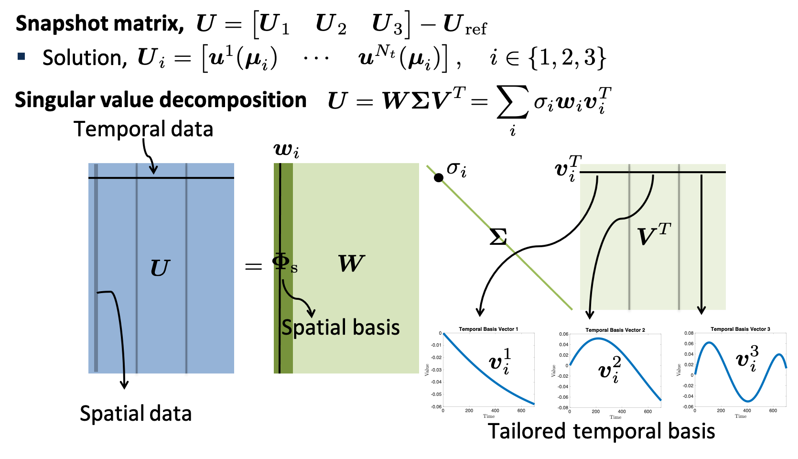

# Features

The goal of libROM is to provide high-performance scalable library for
data-driven reduced order modeling. 

## Proper orthogonal decomposition

One of the core features in libROM is the ability to extract important modes
from given physical simulation data.  The proper othogonal decomposition (POD)
is a popular method for compressing physical simulation data to obtain optimal
"reduced" bases in the following sense:

$$f =\minimize
  \cases{
  \displaystyle \sin(\kappa (x_0+x_1+x_2)) & for 2D  \cr
  \displaystyle \sin(\kappa (x_0+x_1))     & for 3D  
  }$$

The POD modes can be obtained in two equivalent ways: (i)
eigenvalue decomposition and (ii) singular value decomposition (SVD). We take
the latter approach.  

### Efficient data collection

High-fidelity physical simulations generate intensive data in its size, which
makes the data collection daunting. The libROM can be integrated in the physics
solver, and the data is extracted dynamically as the physics solver is running.
For example, the following line can be inserted in the time loop of the physics
solver where the solution is computed:

We introduce four different methods for computing SVDs:

- Static SVD
- incremental SVD
- randomized SVD
- space-time SVD

### Static SVD

### Incremental SVD

### Randomized SVD

### Space--time SVD
The SVD can be applied to extract reduced bases for both spatial and temporal
data.  The procedure is schematically depicted in the figure below:

## Greedy algorithm

Greedy algorithm is a major approach to build a 

## Hyper-reduction

Hyper-reduction is essential to reduce the complexity of nonlinear terms
in physical simulations.

## Extensive Examples

MFEM includes a number of well-documented [example codes](examples.md) that can
be used as tutorials, as well as simple starting points for user applications.
Some of the included example codes are:

 - [Example 1](http://mfem.github.io/doxygen/html/examples_2ex1_8cpp_source.html): nodal H1 FEM for the Laplace problem,
 - [Example 2](http://mfem.github.io/doxygen/html/ex2_8cpp_source.html): vector FEM for linear elasticity,
 - [Laghos](https://github.com/CEED/Laghos): high-order Lagrangian hydrodynamics miniapp,
 - [Remhos](https://github.com/CEED/Remhos): high-order advection remap miniapp,
 - [Mulard](https://computation.llnl.gov/projects/co-design/mulard): multigroup thermal radiation diffusion mini application.

## Open Source

libROM is an open-source software, and can be freely used under the terms of the
[MIT](https://github.com/LLNL/libROM/blob/master/LICENSEi-MIT) and
[APACHE](https://github.com/LLNL/libROM/blob/master/LICENSE-APACHE) license.

<!-- To update the SVG images: in the gh-pages branch of mfem/doxygen do:
     grep 'id="node1" href="$classmfem_1_1FiniteElementCollection.html"' html/inherit*map -->

[FiniteElement]:           http://mfem.github.io/doxygen/html/inherit_graph_389.svg
[FiniteElementCollection]: http://mfem.github.io/doxygen/html/inherit_graph_119.svg
[Element]:                 http://mfem.github.io/doxygen/html/inherit_graph_94.svg
[HyperelasticModel]:       http://mfem.github.io/doxygen/html/inherit_graph_175.svg
[NonlinearFormIntegrator]: http://mfem.github.io/doxygen/html/inherit_graph_296.svg
[LinearFormIntegrator]:    http://mfem.github.io/doxygen/html/inherit_graph_203.svg
[Operator]:                http://mfem.github.io/doxygen/html/inherit_graph_361.svg
[Vector]:                  http://mfem.github.io/doxygen/html/inherit_graph_437.svg

[BlockMatrix]:             http://mfem.github.io/doxygen/html/classmfem_1_1BlockMatrix.html
[ElementTransformation]:   http://mfem.github.io/doxygen/html/classmfem_1_1ElementTransformation.html
[HypreParMatrix]:          http://mfem.github.io/doxygen/html/classmfem_1_1HypreParMatrix.html
[HypreSmoother]:           http://mfem.github.io/doxygen/html/classmfem_1_1HypreSmoother.html
[IterativeSolver]:         http://mfem.github.io/doxygen/html/classmfem_1_1IterativeSolver.html
[ODESolver]:               http://mfem.github.io/doxygen/html/classmfem_1_1ODESolver.html
[SLBQPOptimizer]:          http://mfem.github.io/doxygen/html/classmfem_1_1SLBQPOptimizer.html
[SparseMatrix]:            http://mfem.github.io/doxygen/html/classmfem_1_1SparseMatrix.html
[SparseSmoother]:          http://mfem.github.io/doxygen/html/classmfem_1_1SparseSmoother.html
