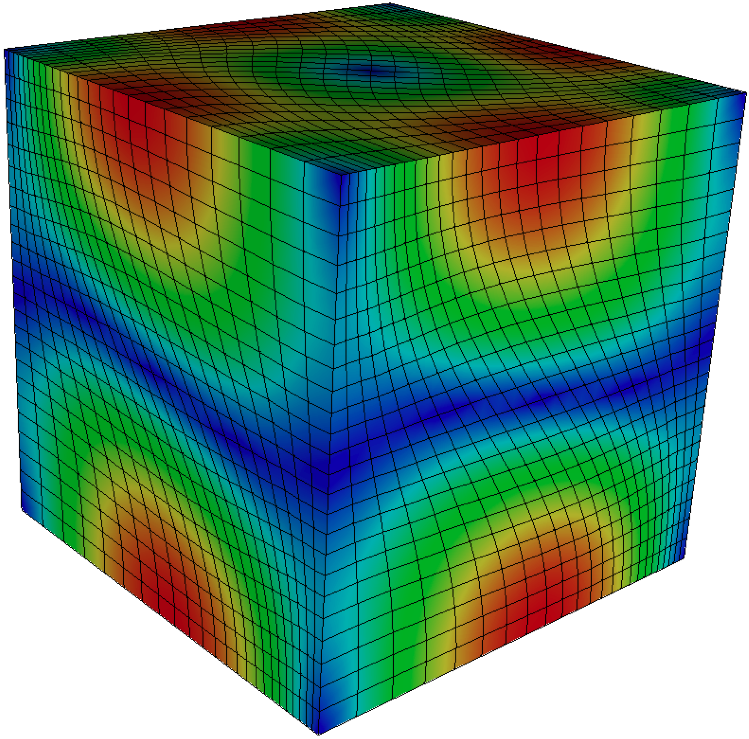

# Gallery

This page collects screenshots from various simulations based on libROM. 

 

*Sedov blast simulated with [Laghos](https://github.com/CEED/Laghos/tree/rom)
and accelerated by [libROM](https://github.com/LLNL/libROM).  Visualization with
[VisIt](https://visit-dav.github.io/visit-website/).*

----

*2D Gresho vortex simulated with
[Laghos](https://github.com/CEED/Laghos/tree/rom) and accelerated by
[libROM](https://github.com/LLNL/libROM).  Visualization with
[VisIt](https://visit-dav.github.io/visit-website/).*

*Triple-point problem simulated with
[Laghos](https://github.com/CEED/Laghos/tree/rom)  and accelerated by
[libROM](https://github.com/LLNL/libROM).  Visualization with
[VisIt](https://visit-dav.github.io/visit-website/).*

----

*Taylor-Green vortex problem simulated with
[Laghos](https://github.com/CEED/Laghos/tree/rom)  and accelerated by
[libROM](https://github.com/LLNL/libROM).  Visualization with
[VisIt](https://visit-dav.github.io/visit-website/).*

*Fibers generated by LDRB approach based on 4 Laplacian solves in the [Cardioid](https://education.llnl.gov/programs/science-on-saturday/lecture/541) project.*

----

*3D Arbitrary Lagrangian-Eulerian (ALE) simulation of a shock-triple point interaction with Q2-Q1 elements in the MFEM-based [BLAST](http://www.llnl.gov/casc/blast) shock hydrodynamics code. Volume visualization with [VisIt](https://visit-dav.github.io/visit-website).*

