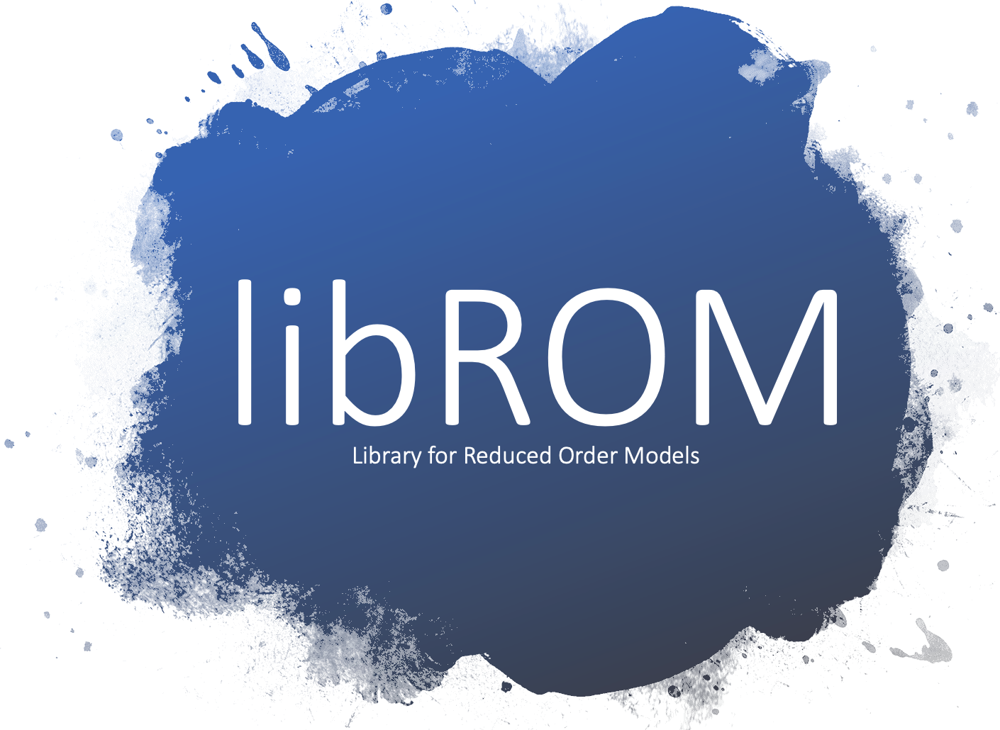

libROM is a _free_, _lightweight_, _scalable_ C++ library for data-driven
physical simulation methods.  It is the main tool box that the reduced order
modeling team at LLNL uses to develop efficient **model order reduction**
techniques and **physics-constrained data-driven methods**. We try to collect
any useful reduced order model routines, which are separable to the
high-fidelity physics solvers, into libROM. Plus, libROM is open source, so
anyone is welcome to suggest new ideas or contribute to the development. Let's
work together for better data-driven technology!

## Features

* [Proper Orthogonal Decomposition](features.md#proper-orthogonal-decomposition)
* [Dynamic mode decomposition](features.md#dynamic-mode-decomposition)
* [Projection-based reduced order models](features.md#projection-based-reduced-order-model)
* [Hyper-reduction](features.md#hyper-reduction)
* [Greedy algorithm](features.md#greedy-sampling-algorithm)

Many more features will be available soon. Stay tuned!

libROM is used in many projects, including
[BLAST](http://www.llnl.gov/casc/blast),
[ARDRA](https://computing.llnl.gov/projects/ardra-scaling-up-sweep-transport-algorithms),
[Laghos](https://github.com/CEED/Laghos/tree/rom), 
[SU2](https://su2code.github.io/),
[ALE3D](https://wci.llnl.gov/simulation/computer-codes/ale3d)
and [HyPar](http://hypar.github.io/a00126.html). Many [MFEM](https://mfem.org)-based ROM
examples can be found in [Examples](examples.md).

See also our [Gallery](gallery.md), [Publications](publications.md) and
[News](news.md) pages.

## Recent News

Date         | Message
------------ | -----------------------------------------------------------------
May 17, 2024 | [DD-NM-ROM](https://github.com/LLNL/DD-NM-ROM) open source code is available in gitHub
May 15, 2024 | [DDFEM](https://doi.org/10.1016/j.cma.2024.117041) paper is published in CMAME
Apr 29, 2024 | [wLaSDI](https://doi.org/10.1016/j.cma.2024.116998) paper is published in CMAME
Apr 10, 2024 | [Gappy AE](https://doi.org/10.1016/j.cma.2024.116978) paper is published in CMAME
Mar 25, 2024 | [DD-NM-ROM](https://doi.org/10.1016/j.cma.2024.116943) paper is published in CMAME
Mar 22, 2024 | [tLaSDI](https://arxiv.org/pdf/2403.05848) arXiv paper is available 
Mar 16, 2024 | [LaSDI book chapter](https://arxiv.org/pdf/2403.10748) arXiv paper is available
Jan 1, 2024 | [GPLaSDI](https://doi.org/10.1016/j.cma.2023.116535) paper is published in CMAME
Dec 5, 2023 | [ScaleupROM](https://github.com/LLNL/scaleupROM) open source code is available in gitHub 
Aug 8, 2023 | [pylibROM](https://github.com/LLNL/pylibROM) open source code is available in gitHub

## libROM tutorials in YouTube
Date         | Title
------------ | -----------------------------------------------------------------
July 22, 2021| [Poisson equation & its finite element discretization](https://youtu.be/YaZPtlbGay4)
Sep. 1, 2021| [Poisson equation & its reduced order model](https://youtu.be/YlFrBP31riA)
Sep. 23, 2021| [Physics-informed sampling procedure for reduced order models](https://youtu.be/A5JlIXRHxrI)
Sep. 11, 2022| [Local reduced order models and interpolation-based parameterization](https://youtu.be/KLyWZQRZ4hU)
Sep. 23, 2022| [Projection-based reduced order model for nonlinear system](https://youtu.be/EfoeOltd9Fo)
Aug. 23, 2023| [Complete derivation of dynamic mode decomposition](https://youtu.be/YmxFkQAHSLM?si=03kdOe99j00IdUuM)

## Latest Release

[Examples](examples.md)
┊ [Code documentation](https://librom.readthedocs.io/en/latest/index.html)
┊ [libROM Sources](https://github.com/LLNL/libROM)
┊ [pylibROM Sources](https://github.com/LLNL/pylibROM)
┊ [LaghosROM Sources](https://github.com/CEED/Laghos/tree/rom/rom)
┊ [ScaleupROM](https://github.com/LLNL/scaleupROM)
┊ [LaSDI Sources](https://github.com/LLNL/LaSDI)
┊ [gLaSDI Sources](https://github.com/LLNL/gLaSDI)
┊ [GPLaSDI Sources](https://github.com/LLNL/GPLaSDI)
┊ [DD-NM-ROM Sources](https://github.com/LLNL/DD-NM-ROM)

[<button type="button" class="btn btn-success">
**Download libROM-master.zip**
</button>](https://github.com/LLNL/libROM/archive/refs/heads/master.zip)

<!---
[Older releases](download.md) ┊ [Python wrapper](https://github.com/mfem/PylibROM)
-->

## Documentation

[Building libROM](building.md)
┊ [Poisson equation](poisson.md)
┊ [Greedy for Poisson](poisson_greedy.md)

New users should start by examining the [example codes](examples.md) and
[tutorials](poisson.md).

We also recommend using [GLVis](http://glvis.org) or
[VisIt](https://visit-dav.github.io/visit-website/) for visualization.

## Contact

Use the GitHub [issue tracker](https://github.com/LLNL/libROM/issues)
to report [bugs](https://github.com/LLNL/libROM/issues/new?labels=bug)
or post [questions](https://github.com/LLNL/libROM/issues/new?labels=question)
or [comments](https://github.com/LLNL/libROM/issues/new?labels=comments).
See the [About](about.md) page for citation information.

