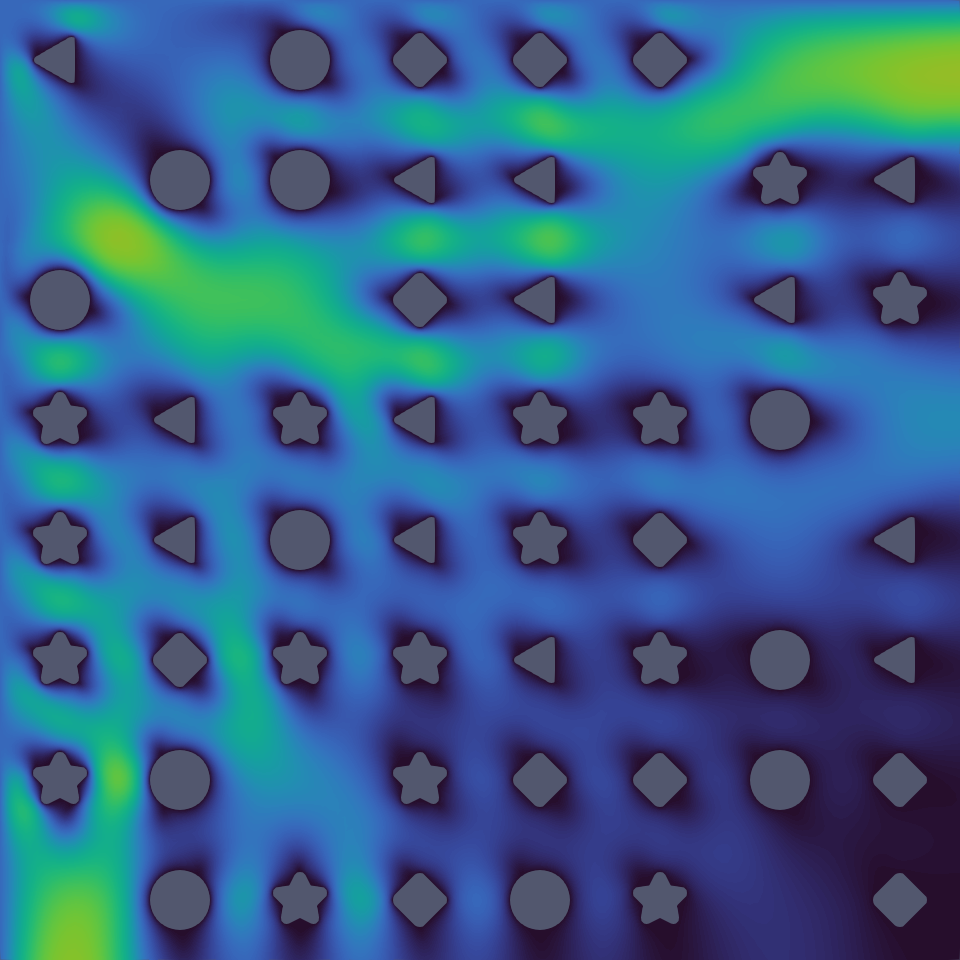

# ScaleupROM

This page provides a list of ScaleupROM example applications. ScaleupROM is a projection-based reduced order model code with discontinuous Galerkin domain decomposition (DG-DD) using libROM and MFEM. It aims to create a robust and efficient large-scale ROM that is trained only from small scale component samples which can be used to solve a variety of physics PDEs. For more information, refer to the [ScaleupROM repo](https://github.com/LLNL/scaleupROM) and [online wiki](https://github.com/LLNL/scaleupROM/wiki).

<!-- ------------------------------------------------------------------------- -->

## Stokes flow

This example demonstrates the use of ScaleupROM to create a reduced order model for the Stokes flow problem discretized using Taylor-Hood elements. The governing equation for Stokes flow is defined as
$$ - \nu \nabla^2 \mathbf{\tilde{u}} + \nabla \mathit{\widetilde{p}} = 0 $$

$$ \nabla \cdot \mathbf{\tilde{u}} = 0 $$

with boundary conditions

$$ \mathbf{\tilde{u}} = \mathbf{g}_{di} $$

$$ \mathbf{n} \cdot ( - \nu \nabla \mathbf{\tilde{u}} + \mathit{\widetilde{p}} \mathbf{I}) = \mathbf{g}_{ne} $$

where $\mathbf{u}$ and $p$ denote the velocity and pressure field respectively, and $\nu \equiv \frac{\mu}{\mu_0} = 1.1$ is the non-dimensionalized dynamic viscosity with respect to a reference value.

The global-scale system is constructed using a random arrangement from five different reference components: empty, circle, triangle, square, and star. In this example, the fluid flows past an array of these components. Sample snapshots for basis training are generated on 2x2 component domains to better capture downstream flow. A total of 1400 sample snapshots were taken for this example.

On each sample domain, the inflow velocity Dirichlet boundary condition is parameterized as

$$ \mathbf{g}_{di} = (g_1 + \Delta g_1 \sin 2\pi (\mathbf{k}_1 \cdot x + \theta_1),\ g_2 + \Delta g_2 \sin 2\pi (\mathbf{k}_2 \cdot x + \theta_2)) $$

where the parameters are chosen from a uniform random distribution,

$$ g_1, g_2 \sim U[-1, 1] $$

$$ \Delta g_1, \Delta g_2 \sim U[-0.1, 0.1] $$

$$ \mathbf{k}_1, \mathbf{k}_2 \sim U[-0.5, 0.5]^2 $$

$$ \theta_1, \theta_2 \sim U[0, 1] $$

Boundaries at the surface of the object inside the domain have a no-slip wall boundary $g_{di} = 0$ and boundaries on interior interfaces have a homogeneous Neumann boundary $g_{ne} = 0$.

The figure above shows the ROM prediction for $\mathbf{u}$ on a 8x8 system composed of random components with parameter values $g_1 = 1.5, g_2 = -0.8, \Delta g_1 = \Delta g_2 = 0$.

One can follow the command line options below to reproduce the numerical results
summarized in the table below:

* **Sample Generation**: `./main -i stokes.sampling.yml`
* **ROM Training**: `./main -i stokes.sampling.yml -f main/mode=train_rom`
* **ROM Building**: `./main -i stokes.sampling.yml -f main/mode=build_rom:main/use_rom=true`
* **ROM Prediction**: `./main -i array.8.yml`

The table below shows the ROM performance for the 8x8 system.

   | FOM Solution time | ROM Solution time | Speed-up | $\mathbf{u}$ relative error | $p$ relative error |
   | ----------------- | ----------------- | -------- | --------------------------- | ------------------ |
   |  0.08298 sec      |  0.00408 sec      |  20.34   |         4.193e-3            |      3.030e-3      |

<!--
_The code that generates the numerical results above can be found in
([stokes_flow](https://github.com/LLNL/scaleupROM/tree/main/examples/stokes_flow/))_
-->

 

<!-- ------------------------------------------------------------------------- -->

